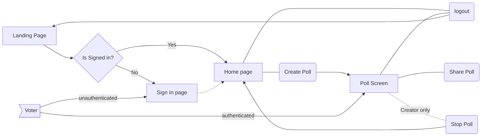

# Planning

---
hideInToc: true
---

# MVP

- Authentication 
    - Login
    - Anonymous Login
    - Signup
    - OAuth
    - Forgot Password
- Polls
    - Create
    - Share
    - Vote
    - Anonymous Vote

<!-- We need to discuss the goals and minimial features for this project -->

---
transition: fade
hideInToc: true
---

# UI/UX Designing

 (Scan the code to view the design on Penpot)

 

<!-- Talk about Penpot
    Open source design tool
    alternative to Figma Adobe XD
    Written in Clojure
    have a good technical documentation and const improving
    make designs get code at the instant
 -->

---
layout: image
image: ./penpot-home.png
hideInToc: true
---

---
layout: center
class: dark-bg
hideInToc: true
---

# Tech Stack

---
layout: default
class: text-center dark-bg
hideInToc: true
---

# Frontend

<v-clicks depth= '1'>

</v-clicks>

# Backend

<v-click>

</v-click>

<!-- Svelte - web framework. Reactive and easy to use. Not setState useState stuffs.
    Pink Design is Appwrite's open-source design system for building consistent and reusable user interfaces. Pink is designed to prioritize collaboration, dev experience, and accessibility.
 -->

---

# App Flow

