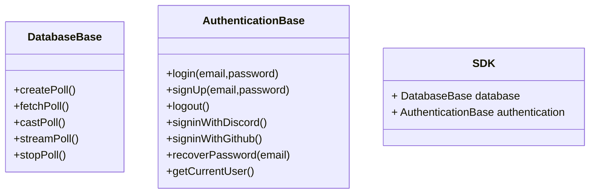
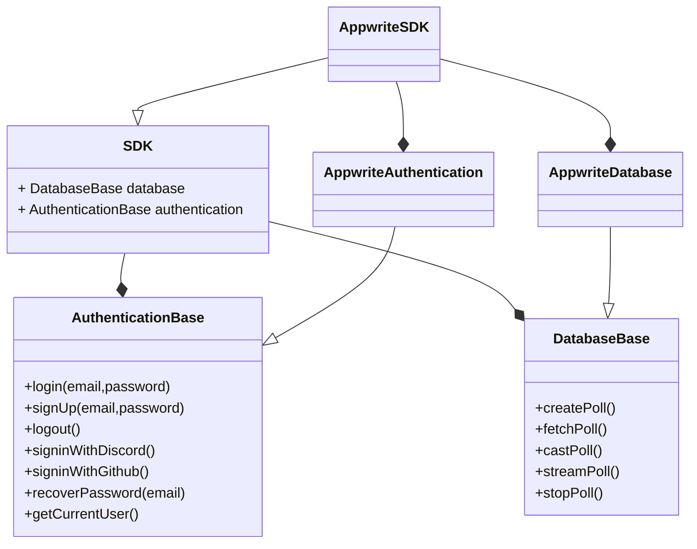
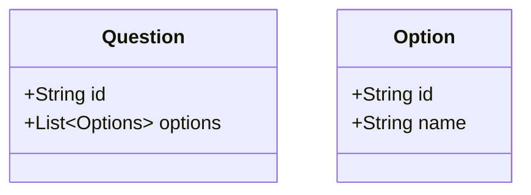

<div flex gap-x-24>

<h1 class="self-center"> Programming Time </h1>


</div>

<style>
    h1{
        color: #F02C64;
        font-weight: 600;

    }


  

</style>

---
layout: center

---

# Setup Project

<style>
    h1{
        color: #F02C64;
        font-weight: 600;

    }


  

</style>

---
hideInToc: true
---

# Starter Template


<div class="w-5/12 mx-auto mt-12">

</div>


<style>

     h1{
        color: #373d4d;
        font-weight: 600;

    }

    </style>


---

# Setup Appwrite

### Head over to [cloud.appwrite.io](https://cloud.appwrite.io) and create an account

  


<style>
    h1{
        color: #F02C64;
        font-weight: 600;

    }
</style>

  <!-- Discuss about creating a new project -->

---

# Appwrite Architecture


<style>
    h1{
              color: #373d4d;
        font-weight: 600;

    }
</style>


---
hideInToc: true
---
# Directory Structure


```bash
.
├── functions # Cloud functions
│   └── create-poll 
├── public # static assets
├── src
│   ├── assets # images
│   └── lib
│       ├── components # Reusable svelte components
│       ├── elements # forms
│       ├── layout
│       ├── models # custom model interfaces
│       ├── pages # Pages
│       ├── sdk 
│       │   ├── appwrite
│       │   └── mock
│       ├── store # state management variables
│       └── utils # misc stuffs
└── tests # unit tests but not really
```

<style>

     h1{
        color: #373d4d;
        font-weight: 600;

    }

    </style>

---

# Abstract Factory Pattern

A creational design pattern that lets you produce families of related objects without specifying their concrete classes.


<style>
    h1{
        color: #F02C64;
        font-weight: 600;

    }
</style>

---
hideInToc: true
---
# Our Use case
<center>





</center>

* `DatabaseBase` and `AuthenticationBase` are interfaces
* `SDK` is the abstract factory composes of the interfaces


<style>
    h1{
        color: #F02C64;
        font-weight: 600;

    }
</style>

---
hideInToc: true
---

# What do we see

* `AppwriteAuthentication` and `AppwriteDatabase` are concrete classes
* `AppwriteSDK` is the concrete factory that implements the abstract factory

<center>




</center>

<style>
    h1{
         color: #373d4d;
        font-weight: 600;

    }
</style>


---
layout: center
hideInToc: true
---
# Setup OAuth


<style>

     h1{
        color: #F02C64;
        font-weight: 600;

    }

    </style>

    <!-- Appwrite has 30 Auth Providers -->


---
layout: two-cols
hideInToc: true
---
# Github OAuth

For setting up Github Oauth we need appId and secret from Github:


::right::


<style>

     h1{
        color: #373d4d;
        font-weight: 600;

    }

    </style>

---
layout: two-cols
hideInToc: true
---


::right::


---
layout: center
hideInToc: true
---

# Same goes for Discord 🙂

(Read their docs for more info)


<style>

     h1{
        color: #F02C64;
        font-weight: 600;

    }

    </style>


---

# Cloud Functions

- Appwrite Functions allow you to extend and customize your Appwrite server functionality by executing your custom code. 

- Appwrite Functions run in a secure, isolated Docker container. By default, Appwrite supports multiple runtimes for different languages that you can use to run your code.

<style>

     h1{
        color: #F02C64;
        font-weight: 600;

    }

    </style>


---
hideInToc: true
---


# Setup Cloud Functions

The recommended way is to do by using the Appwrite CLI

<div flex gap-12>

<div>

### Install via NPM

```bash
npm install -g appwrite
```

### Login to Appwrite

```bash
appwrite login
```
</div>

<div >

### Create a new function

```bash
appwrite init function
? What would you like to name your function? My Awesome Function
? What runtime would you like to use? Node.js (node-18.0)
✓ Success! 
```


### Deploy the function

```bash
appwrite deploy function
? Which functions would you like to deploy? Awesome Function (621229798628cf5bf712)
ℹ Info Deploying function Awesome Function ( 621229798628cf5bf712 )
✓ Success Deployed Awesome Function ( 621229798628cf5bf712 )
```

</div>

</div>


<style>

     h1{
        color: #F02C64;
        font-weight: 600;

    }

    h3{
        color: #373d4d;
        font-weight: 500;
        margin-top: 2rem;
        margin-bottom: 0.5rem;
    }

    </style>

---
hideInToc: true
---

# Database Collection + Attributes



<style>


     h1{
        color: #373d4d;
        font-weight: 600;

    }

    </style>

---
layout: center
---

# Setup SDK

<style>

     h1{
        color: #F02C64;
        font-weight: 600;
        font-size: 4rem;
    }

   

    </style>


---

# Install the SDK

<div class="grid grid-cols-2 gap-8">
```bash
npm install appwrite
```

```bash
yarn install appwrite
```
</div>

<br/>

# Initialise the SDK

```ts
// appwriteSdk.ts
import { Client } from "appwrite";
//Other imports

class AppwriteSDK implements SDK {

    private client: Client = new Client().setEndpoint(VARS.APPWRITE_ENDPOINT)
        .setProject(VARS.PROJECT_ID);

    Authentication: AuthenticationBase = new AppwriteAuthentication(this.client);
    Database: DatabaseBase = new AppwriteDatabase(this.client);
}


export default new AppwriteSDK();
```

<style>


     h1{
        color: #373d4d;
        font-weight: 600;

    }

    </style>

---
hideInToc: true
---

# Authentication

```ts {all|5-6|8-12|14-24|25-27|28-30|31-37|38-44|45-54|55-57|58-69|all}  {maxHeight: '445px' , lines: true}
//services/authentication.ts
import { Account, Client, Avatars } from "appwrite";

export default class AppwriteAuthentication extends AuthenticationBase {
	private account: Account;
	private avatar: Avatars;

	constructor(client: Client) {
		super();
		this.account = new Account(client);
		this.avatar = new Avatars(client);
	}

	public async login(email: string, password: string): Promise<Session> {
		const response = await this.account.createEmailSession(email, password);

		return {
			id: response.userId,
			createdAt: response.$createdAt,
			clientName: response.clientName,
			clientVersion: response.clientVersion,
			expire: response.expire
		};
	}
	public async signUp(name: string, email: string, password: string) {
		await this.account.create(name, email, password);
	}
	public async logout(): Promise<void> {
		this.account.deleteSession('current');
	}
	public loginWithDiscord(): void {
		this.account.createOAuth2Session(
			'discord',
			`${window.location.href}/home`,
			window.location.href
		);
	}
	public loginWithGithub(): void {
		this.account.createOAuth2Session(
			'github',
			`${window.location.href}/home`,
			window.location.href
		);
	}
	public async signInAnonymously(): Promise<Session> {
		const response = await this.account.createAnonymousSession();
		return {
			id: response.userId,
			createdAt: response.$createdAt,
			clientName: response.clientName,
			clientVersion: response.clientVersion,
			expire: response.expire
		};
	}
	public recoverPassword(email: string) {
		this.account.createRecovery(email, window.location.hostname + '/#/recover');
	}
	public async getCurrentUser(): Promise<User> {
		const response = await this.account.get();
		const avatar = this.avatar.getInitials(
			response.name.length > 0 ? response.name : 'Anonymous User'
		);
		return {
			id: response.$id,
			name: response.name.length > 0 ? response.name : 'Anonymous User',
			email: response.email,
			avatar: avatar
		};
	}
}

```


<style>


     h1{
        color: #F02C64;
        font-weight: 600;

    }

    </style>

---
hideInToc: true
---

# Databases

```ts {all|6-8|10-14|16-39|40-60|62-79|81-85|87-89|all} {maxHeight: '445px' , lines: true}
//services/database.ts
import { Databases, Functions, type Client, Query } from 'appwrite';
//Other imports 

export default class AppwriteDatabase implements DatabaseBase {
	private database: Databases;
	private function: Functions;
	private client: Client;

	constructor(client: Client) {
		this.client = client;
		this.database = new Databases(client);
		this.function = new Functions(client);
	}

	public async createPoll(poll: Omit<Poll, 'id'>): Promise<Poll> {
		const response = await this.function.createExecution(
			VARS.CREATE_POLL_FUNCTION_ID,
			JSON.stringify(poll)
		);

		interface PollResponse {
			collectionId: string;
			collectionName: string;
			attributes: string[];
		}

		let rawPoll: PollResponse = JSON.parse(response.response);
		return {
			id: rawPoll.collectionId,
			question: rawPoll.collectionName,
			options: rawPoll.attributes.map<Option>((option) => {
				return {
					id: option,
					name: option
				};
			})
		};
	}
	public async fetchPoll(poll: Poll): Promise<PollResult[]> {
		const response = await this.database.listDocuments(VARS.DATABASE_ID, poll.id, [
			Query.limit(100)
		]);
		const documents = response.documents;
		const options = poll.options.map((opt) => opt.id);
		let result: PollResult[] = options.map((opt) => {
			return {
				optionId: opt,
				value: []
			};
		});
		documents.map((document) => {
			options.forEach((opt) => {
				if (document[opt] != null || document[opt] != undefined) {
					result.find((res) => res.optionId === opt)?.value.push(document[opt]);
				}
			});
		});
		return result;
	}

	public streamPoll(poll: Poll, handleVotes: (vote: Vote) => void | PromiseLike<void>) {
		return this.client.subscribe(
			`databases.${VARS.DATABASE_ID}.collections.${poll.id}.documents`,
			(event) => {
				const votes = poll.options
					.map((opt) => {
						if (event.payload[opt.id] != null || event.payload[opt.id] != undefined) {
							return {
								id: event.payload['$id'],
								optionId: opt.id
							};
						}
					})
					.filter((option) => !!option);
				return handleVotes(votes[0]);
			}
		);
	}

	public async castPoll(pollId: string, vote: Vote): Promise<void> {
		const response = await this.database.createDocument(VARS.DATABASE_ID, pollId, vote.id, {
			[vote.optionId]: vote.id
		});
	}

	public async stopPoll(pollId: string) {
		const response = await this.function.createExecution(VARS.STOP_POLL_FUNCTION_ID);
	}
}

```

<style>


     h1{
        color: #F02C64;
        font-weight: 600;

    }

    </style>

---
hideInToc: true
---

# Create Poll Function

```dart {55-106|6-17|58-66|68-78|37-50|80-96|98-102|103-106|all} {maxHeight: '445px' , lines: true}
import 'dart:convert';

import 'package:dart_appwrite/dart_appwrite.dart';
import 'package:dart_appwrite/models.dart';

/*
  'req' variable has:
    'headers' - object with request headers
    'payload' - request body data as a string
    'variables' - object with function variables

  'res' variable has:
    'send(text, status: status)' - function to return text response. Status code defaults to 200
    'json(obj, status: status)' - function to return JSON response. Status code defaults to 200
  
  If an error is thrown, a response with code 500 will be returned.
*/

class Option {
  final String id;
  final String name;
  Option({
    required this.id,
    required this.name,
  });

  factory Option.fromMap(Map<String, dynamic> map) {
    return Option(
      id: map['id'] ?? '',
      name: map['name'] ?? '',
    );
  }

  factory Option.fromJson(String source) => Option.fromMap(json.decode(source));
}

class Poll {
  final String question;
  final List<Option> options;
  Poll({
    required this.question,
    required this.options,
  });

  factory Poll.fromMap(Map<String, dynamic> map) {
    return Poll(
      question: map['question'] ?? '',
      options: List<Option>.from(map['options']?.map((x) => Option.fromMap(x))),
    );
  }

  factory Poll.fromJson(String source) => Poll.fromMap(json.decode(source));
}

Future<void> start(final req, final res) async {
  final client = Client();

  if (req.variables['APPWRITE_FUNCTION_ENDPOINT'] == null || req.variables['APPWRITE_FUNCTION_API_KEY'] == null) {
    print("Environment variables are not set. Function cannot use Appwrite SDK.");
    return;
  } else {
    client
        .setEndpoint(req.variables['APPWRITE_FUNCTION_ENDPOINT'])
        .setProject(req.variables['APPWRITE_FUNCTION_PROJECT_ID'])
        .setKey(req.variables['APPWRITE_FUNCTION_API_KEY']);
  }

  try {
    final database = Databases(client);
    final jsonPoll = req.payload;
    if (jsonPoll == null) {
      res.json({'Error': 'Poll Data is Missing'});
      return;
    }

    const databaseId = 'default';

    final Poll poll = Poll.fromJson(jsonPoll);

    /// Create Collection
    final collection = await database
        .createCollection(databaseId: databaseId, collectionId: ID.unique(), name: poll.question, permissions: [
      Permission.read(Role.users()),
      Permission.write(Role.users()),
    ]);

    final List<AttributeString> attributeResponse = [];
    for (final option in poll.options) {
      final attribute = await database.createStringAttribute(
          databaseId: databaseId,
          collectionId: collection.$id,
          key: option.id,
          size: option.name.length + 20,
          xrequired: false);
      attributeResponse.add(attribute);
    }

    res.json({
      'collectionId': collection.$id,
      'collectionName': collection.name,
      'attributes': attributeResponse.map((attribute) => attribute.key).toList(),
    });
  } on Exception catch (e) {
    res.json({'error': e.toString()});
  }
}
```


<style>


     h1{
         color: #373d4d;
        font-weight: 600;

    }

    </style>